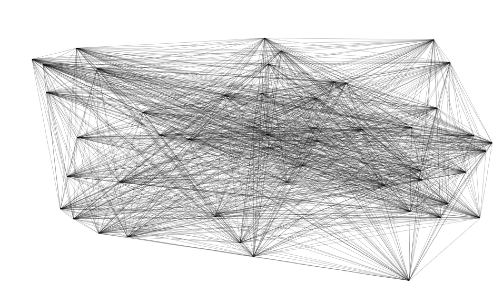

# Assignment A

Create a series of 3 sketches that resemble one work of each of the following artists: Frieder Nake, Sol Lewitt, Ryoji Ikeda

##### Sol Lewitt - Wall Drawing #118 (fifty randomly placed points connected by lines)

##### Ryoji Ikeda - Test Pattern

##### Frieder Nake - 	6/7/64 Nr. 20 Zufälliger Polygonzug

