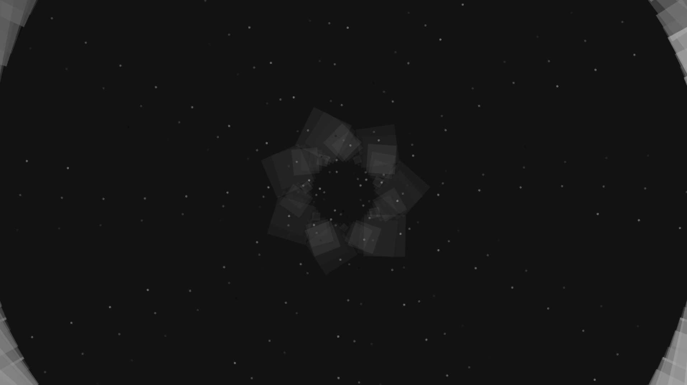
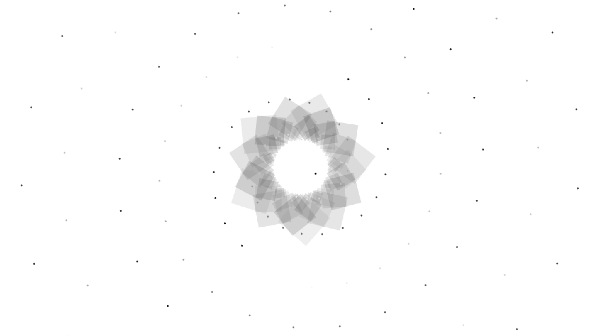
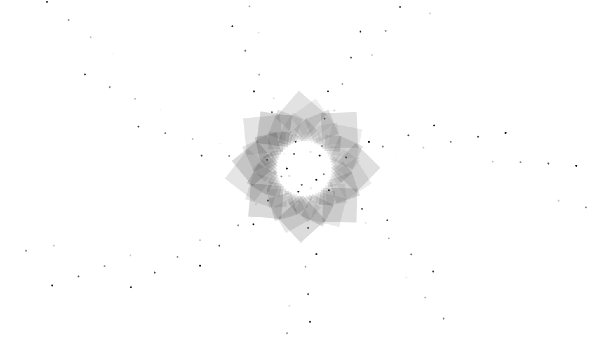
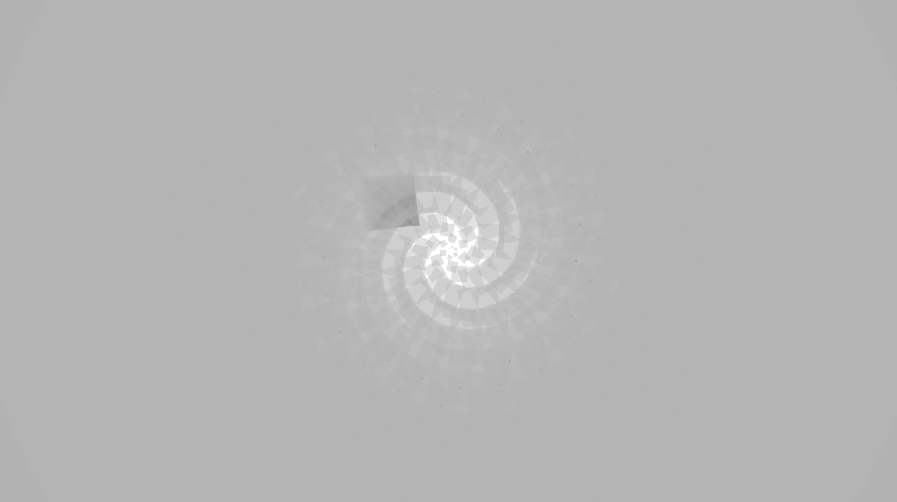
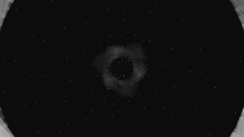

#Assignment B

For this assignment i want to work with rotating shapes. So i started out with writing a sketch with a shape spinning in the middle of the screen. Then i added on more complex shapes around it. I also experimented with the changing of colour form black to white creating a strobe effect. I also created dots that seem to be converging into the middle. 

###Images

###GIF

###Video Link
<https://vimeo.com/213627359>

