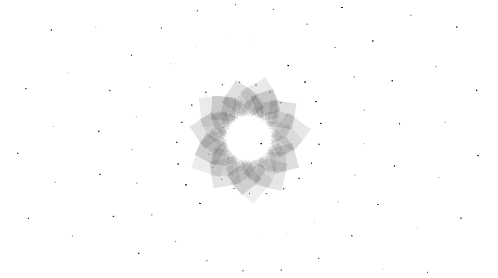
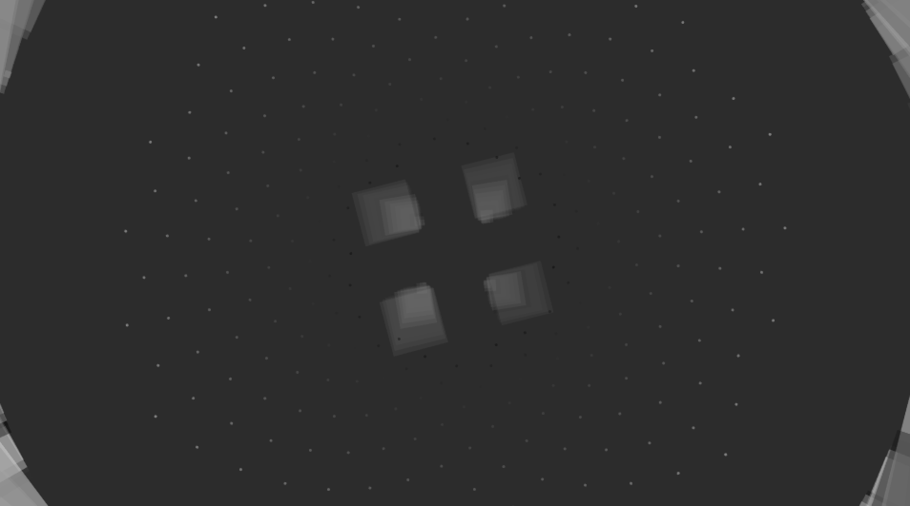
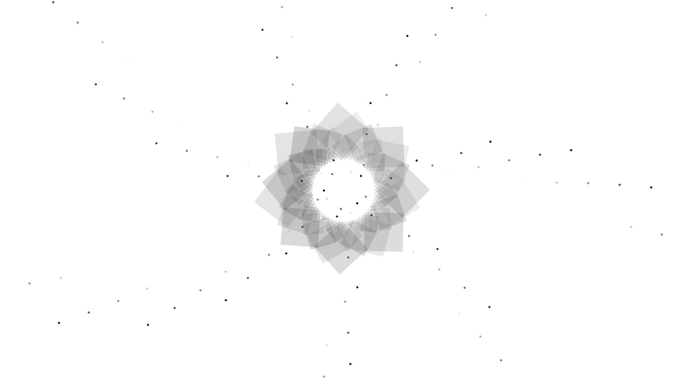
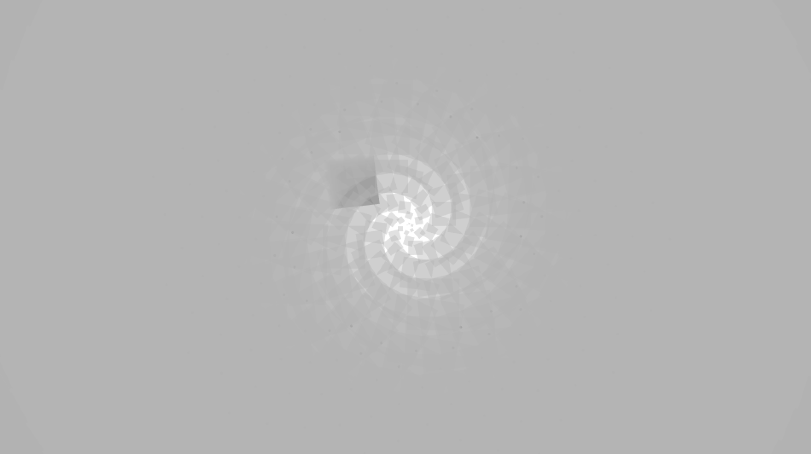

#Assignment B

Use a selection of your current Processing sketches which use code to animate abstract, geometric visuals. Add your own sound track that supports the visuals and create a 15 seconds long generative video.

For this assignment i want to work with rotating shapes. So i started out with writing a sketch with a shape spinning in the middle of the screen. Then i added on more complex shapes around it. I also experimented with the changing of colro form black to white creating a strobe effect. I also created dots that seem to be converging into the middle. 

Gif*

