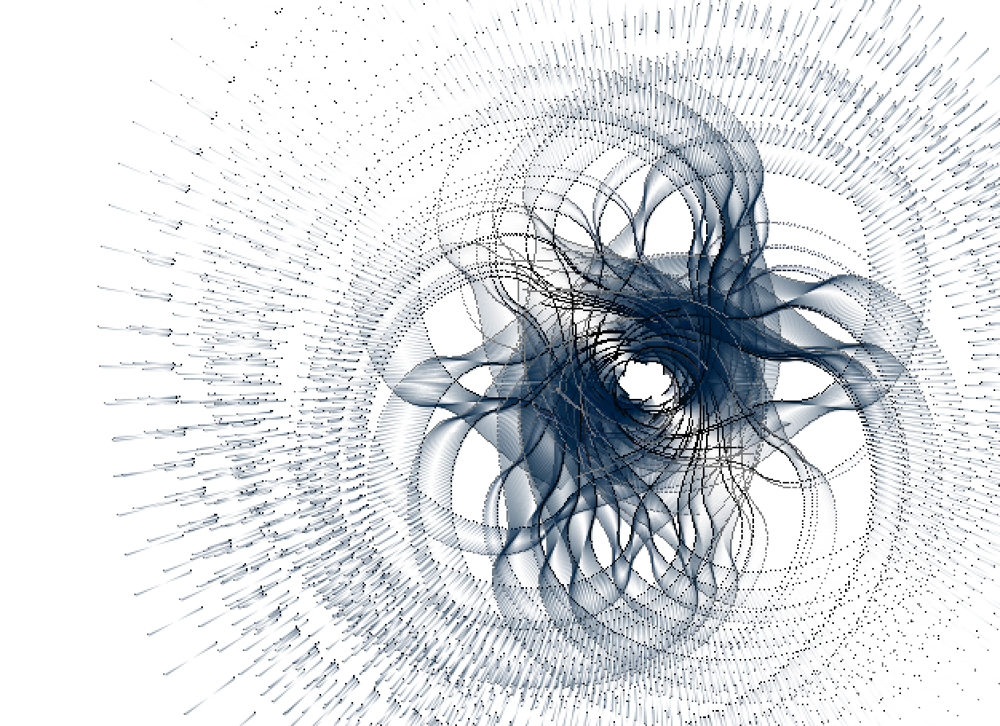
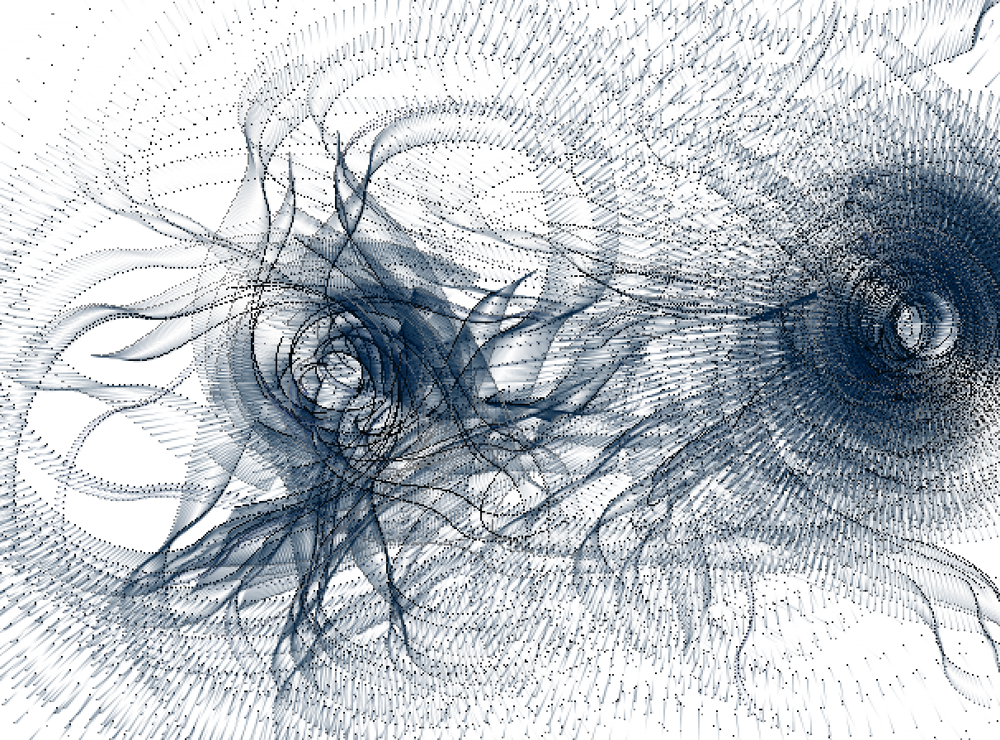

# Assignment C

I have chosen is “withoutTitle” by Lia, a software machine exploring the boundaries of control.
https://processing.org/exhibition/works/withouttitle/index_link.html

Why i like it? 

I like this project because it is very aesthetically pleasing and it looks complex. The algorithm that is used to generate this flow and pattern is also very interesting because it feels very unpredictable at times. The lines that are produced are in a gradient from light to dark, which gives it a lot of depth even though there are a lot of it happening at the same time.  The lines that are encircling the mouse cursor are continuously circling the cursor, following the mouse movement. Depending on the speed the mouse moves, the lines seems to follow at the velocity of the movement. This makes it have a lot more interesting patterns and movements. When the mouse stays at one spot, the lines will continuously circle the mouse. This project is interesting in the way of movements, that produces a very smooth and floating feeling. 

How it works?

There is an array of dots. The dots are in rotation around the cursor. The dots are generated and they circle around mouse cursor following an algorithm. The dots do not disappear after they are being generated. When the mouse is pressed, everything disappears and restarts. 